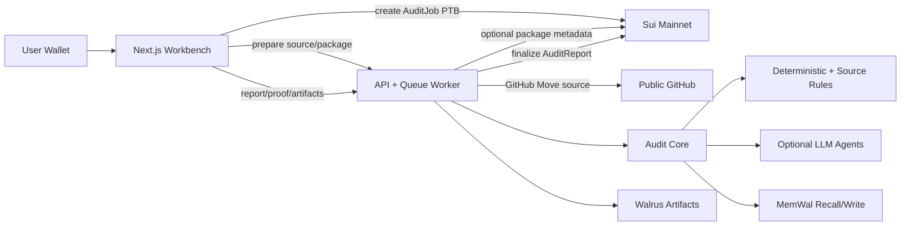

# TuskScan Plan

## Positioning

TuskScan is a wallet-native AI pre-audit workbench for Sui Move packages.

It is built for the Sui Overflow Walrus track around one simple story: an audit agent should not forget what it learned. Each paid scan stores durable Walrus artifacts, anchors proof metadata on Sui, and writes reusable exploit memory into MemWal so later scans can recall similar patterns.

TuskScan is not a professional audit replacement. It is fast AI pre-audit assistance for developers who want a structured first pass before deeper human review.

## Current Product

Users can:

- Connect a Sui wallet.
- Paste a public GitHub URL pointing at a Move package, or use a deployed package ID fallback.
- Load a scoped Move package snapshot from GitHub source.
- Pay SUI through the TuskScan Move contract to create an onchain `AuditJob`.
- Run deterministic and source-aware Sui Move audit rules.
- Optionally run LLM researcher, exploit-writer, patch-reviewer, and false-positive critic agents through an OpenAI-compatible provider such as OpenRouter.
- Recall previous exploit memory from MemWal and mark matching findings as memory-assisted.
- Store package/source snapshots, findings, public/private reports, run logs, source context, and memory diffs on Walrus.
- Finalize an onchain `AuditReport` proof object.
- Reopen readable artifacts through the TuskScan API while preserving raw Walrus IDs as proof metadata.

## Architecture

## Audit Pipeline

1. Prepare target from GitHub source or package metadata.
2. Normalize Move modules, structs, public/entry functions, and source evidence.
3. Hash the prepared snapshot.
4. User pays and creates a shared `AuditJob` on Sui.
5. API verifies the payment transaction and job object.
6. Queue worker recalls MemWal exploit patterns.
7. Scanner runs deterministic metadata and source-aware rules.
8. Optional LLM agents review, critique, and enrich explanations.
9. Report and memory bundles are generated.
10. Walrus stores artifacts and verifies hashes.
11. Sui finalization stores report proof metadata.
12. MemWal writes reusable vulnerability patterns and observations.
13. UI shows findings, memory calibration, artifact links, and Sui proof.

## Agent Roles

- Scanner Agent: applies deterministic and source-aware rules.
- Memory Agent: recalls MemWal records before scanning and writes reusable records after scanning.
- Researcher Agent: groups findings by risk family and reviews architecture context when LLMs are configured.
- Exploit Writer Agent: drafts exploit/test ideas for high-signal findings.
- Patch Reviewer Agent: suggests remediation steps and test additions.
- False Positive Critic: keeps, downgrades, or drops findings with structured reasons.
- Report Agent: produces public/private reports and artifact bundles.

## Artifact Model

Walrus stores:

- `package-snapshot.json`
- `findings.json`
- `memory-diff.json`
- `audit-run-log.json`
- `source-context.json`
- `public-report.md`
- `private-report.md`

The app displays browser-readable API URLs for artifacts and keeps raw `walrus://` IDs visible as proof metadata.

## Memory Model

MemWal stores:

- `vulnerability_pattern`: reusable Sui Move exploit knowledge keyed by rule, category, severity, signals, exploit model, and fix pattern.
- `audit_observation`: lightweight package-specific evidence that links a scan finding to a reusable pattern.

At scale, recall must stay bounded. The worker should retrieve a small relevant set, not every historical record. Future work should dedupe repeated observations and compact them into stronger pattern memories.

## Demo Script

1. Run Package A from GitHub source.
2. Confirm findings are produced and artifacts are readable through the proof panel.
3. Confirm MemWal writes are indexed.
4. Run Package B from GitHub source.
5. Confirm Package B shows recalled memory and at least one memory-assisted finding.
6. Run Package C to show a separate bug family.

Suggested URLs:

- `https://github.com/kezuflow/tuskscan/tree/main/move/demo-package-a`
- `https://github.com/kezuflow/tuskscan/tree/main/move/demo-package-b`
- `https://github.com/kezuflow/tuskscan/tree/main/move/demo-package-c`

## Hackathon Readiness

Good enough:

- Real wallet flow.
- Real Sui `AuditJob` and `AuditReport` objects.
- Real Walrus artifact storage.
- Real MemWal memory recall/write path.
- GitHub source scoping for Sui Move packages.
- Dense workbench UI for live demo.
- Deterministic tests for audit rules, storage, Sui verification, and API lifecycle.

Known limitations:

- Not formal verification.
- Not symbolic execution.
- Generated tests are skeletons unless sandbox fixtures are bound.
- Source/package equivalence is currently best-effort module matching, not bytecode/source-map proof.
- LLM agents are optional and depend on provider configuration.
- Manual E2E with real env should be rehearsed before judging.

## Next Milestones

- Add memory dedupe and compaction for high-volume scan history.
- Add human reviewer confirmation that writes higher-trust MemWal records.
- Bind generated exploit tests to project fixtures.
- Add stronger source/package equivalence checks.
- Add report tiers: instant pre-audit, sandbox-verified, human-reviewed.
- Add direct artifact preview/download affordances for all Walrus artifacts.
