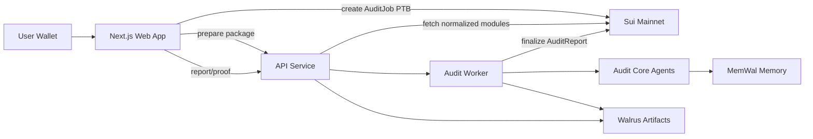

# TuskScan

TuskScan is a Sui Overflow Walrus-track project for wallet-native AI pre-audits of deployed Sui Move packages.

Users connect a Sui wallet, submit a deployed package ID, pay SUI into an onchain `AuditJob`, and receive a multi-agent pre-audit report. Normalized package snapshots, findings, reports, run logs, and memory diffs are stored as Walrus artifacts. Exploit lessons are written to a MemWal-compatible memory layer so later audits can recall prior patterns.

> TuskScan is AI pre-audit assistance for developer review. It is not a professional security audit and must not be treated as deployment approval.

## Architecture



## Workspace

- `apps/web`: Next.js app with Sui wallet connect, package prepare, payment/run flow, report/proof UI.
- `apps/api`: Node HTTP API for prepare/create/status/report/verify routes.
- `apps/worker`: paid audit worker with retry/dead-letter behavior.
- `packages/shared`: shared audit/report types.
- `packages/sui-integration`: Sui JSON-RPC package normalization and stable hashing.
- `packages/audit-core`: deterministic scanner rules and agent workflow.
- `packages/storage`: Walrus and MemWal-compatible storage helpers.
- `move/tuskscan`: Sui Move package for `AuditJob`, `AuditReport`, and operator finalization.
- `move/demo-package-a`: intentionally unsafe demo package that teaches memory.
- `move/demo-package-b`: intentionally unsafe demo package that should recall memory from A.
- `docs/demo-packages.md`: publish commands and package ID recording area.

## Setup

Install dependencies:

```powershell
pnpm install
```

Install Sui CLI with `suiup`, then install the mainnet-compatible toolchain:

```powershell
suiup install sui@mainnet
suiup default set sui@mainnet
sui client active-address
```

Fund the active address with real mainnet SUI before publishing or running paid audits.

## Environment

Local env files are app-specific.

For local UI/API development, this repo includes:

- `apps/api/.env.local`: sets `TUSKSCAN_ENV=localhost` and mainnet Sui RPC.
- `apps/web/.env.local`: points the web app at `http://localhost:8787`.

Use `TUSKSCAN_ENV=localhost` for local development. For the real hackathon demo, set `TUSKSCAN_ENV=production` and fill in the real Sui/Walrus/MemWal values.

`apps/web/.env.local`:

```env
NEXT_PUBLIC_TUSKSCAN_API_URL=http://localhost:8787
NEXT_PUBLIC_TUSKSCAN_NETWORK=mainnet
NEXT_PUBLIC_TUSKSCAN_PACKAGE_ID=<published move/tuskscan package id>
NEXT_PUBLIC_TUSKSCAN_CONFIG_ID=<shared AuditConfig object id created when move/tuskscan was published>
```

`NEXT_PUBLIC_TUSKSCAN_PACKAGE_ID` and `NEXT_PUBLIC_TUSKSCAN_CONFIG_ID` are required for the real wallet PTB. The web app no longer falls back to a mock payment digest.

`apps/api/.env.local` or deployment environment:

```env
PORT=8787
TUSKSCAN_ENV=production
SUI_NETWORK=mainnet
SUI_RPC_URL=https://fullnode.mainnet.sui.io:443
DATABASE_URL=<Supabase Postgres connection string>
TUSKSCAN_PRICE_MIST=100000000
TUSKSCAN_PACKAGE_ID=<published move/tuskscan package id>
TUSKSCAN_CONFIG_ID=<shared AuditConfig object id created when move/tuskscan was published>
TUSKSCAN_OPERATOR_ADDRESS=<operator wallet address paid by create_audit_job>
TUSKSCAN_OPERATOR_CAP_ID=<OperatorCap object id created when move/tuskscan was published>
TUSKSCAN_OPERATOR_PRIVATE_KEY=<operator Ed25519 private key for finalize_report>
WALRUS_AGGREGATOR_URL=https://aggregator.walrus-mainnet.walrus.space
WALRUS_PUBLISHER_URL=<publisher endpoint that supports PUT /v1/blobs>
MEMWAL_PRIVATE_KEY=<MemWal delegate/private key>
MEMWAL_ACCOUNT_ID=<MemWal account id>
MEMWAL_NAMESPACE=tuskscan
MEMWAL_SERVER_URL=https://relayer.memwal.ai
LLM_API_KEY=<optional OpenAI-compatible API key for researcher/exploit/critic agents>
LLM_MODEL=gpt-4.1-mini
LLM_BASE_URL=https://api.openai.com/v1
TUSKSCAN_RUN_MOVE_TESTS=0
TUSKSCAN_SANDBOX_TIMEOUT_MS=120000
TUSKSCAN_SUI_BIN=sui
```

The API loads `apps/api/.env` and `apps/api/.env.local` automatically when run through `pnpm dev`. `localhost` mode is for opening the app and local package work. `production` mode is the real demo path and requires Walrus, MemWal, payment verification, and operator finalization envs.

Walrus Mainnet has a public Mysten aggregator, but no public unauthenticated Mysten publisher. The current API expects a publisher endpoint that supports `PUT /v1/blobs`. If you want to use a Mainnet upload relay instead, add relay or Walrus TypeScript SDK support before setting `TUSKSCAN_ENV=production`.

Supabase is used as the app index so a wallet can see prior audits after the API restarts. Get `DATABASE_URL` from Supabase dashboard: Project Settings -> Database -> Connection string -> URI. Use the server-side Postgres connection string, not the browser anon key. The API auto-creates the `audit_jobs` table on first use; the same schema is available at `supabase/schema.sql` if you prefer running it manually in Supabase SQL Editor.

The Prisma schema for the same table lives at `apps/api/prisma/schema.prisma`. For Supabase pooler connections, use `db:apply`; it applies `supabase/schema.sql` through `DATABASE_URL`.

```powershell
pnpm --filter api db:apply
pnpm --filter api db:generate
pnpm --filter api db:studio
```

Set `TUSKSCAN_RUN_MOVE_TESTS=1` only on an API machine with `git` and `sui` available. Use `TUSKSCAN_SUI_BIN` when the Sui binary is not on `PATH`. When enabled, TuskScan clones the submitted GitHub repo into a temporary sandbox, runs `sui move test` at the selected Move package root, injects generated compile-only exploit regression skeletons, and runs `sui move test tuskscan_`. This is not formal verification yet; it proves the package baseline and generated test harness compile path, then leaves fixture binding notes for concrete exploit PoCs.

## Run

Start the API:

```powershell
pnpm --filter api dev
```

Start the web app:

```powershell
pnpm --filter web dev
```

Open `http://localhost:3000`.

## Demo Script

1. Publish the core TuskScan Move package:

```powershell
cd E:\GithubProjects\sui-overflow\tuskscan\move\tuskscan
sui client publish --gas-budget 100000000
```

Set `NEXT_PUBLIC_TUSKSCAN_PACKAGE_ID` and `TUSKSCAN_PACKAGE_ID` to the published package ID. Record the `OperatorCap` object ID from the publish output as `TUSKSCAN_OPERATOR_CAP_ID`, and set both operator address env vars to the wallet that should receive audit payments.

2. Publish the demo packages:

```powershell
cd E:\GithubProjects\sui-overflow\tuskscan\move\demo-package-a
sui client publish --gas-budget 100000000

cd E:\GithubProjects\sui-overflow\tuskscan\move\demo-package-b
sui client publish --gas-budget 100000000
```

Record IDs in `docs/demo-packages.md`.

3. Start API and web.
4. Connect wallet.
5. Prepare Package A, pay, run audit, and verify artifacts.
6. Prepare Package B, pay, run audit, and confirm at least one memory-assisted finding.

The pitch: Package A teaches the agent an exploit pattern; Package B proves the memory is portable and reusable through the Walrus/MemWal data layer.

## MemWal Memory Model

TuskScan stores reusable vulnerability knowledge in MemWal as structured records, not only as free-form report text.

- `vulnerability_pattern`: reusable Sui Move security knowledge keyed by rule/category. It stores signals, exploit model, fix pattern, and false-positive checks.
- `audit_observation`: a lightweight package-specific receipt that links one finding back to a reusable pattern.

This makes MemWal the agent memory layer: future audits recall prior Sui Move exploit patterns and use them to mark findings as memory-assisted. Supabase remains the app index for wallet history, while Walrus stores verifiable report artifacts.

## Checks

```powershell
pnpm lint
pnpm check-types
pnpm build
pnpm --filter @repo/audit-core test
pnpm --filter @repo/storage test
pnpm --filter api test
pnpm --filter worker test
sui move test
```

Demo package checks:

```powershell
cd E:\GithubProjects\sui-overflow\tuskscan\move\demo-package-a
sui move test

cd E:\GithubProjects\sui-overflow\tuskscan\move\demo-package-b
sui move test
```
