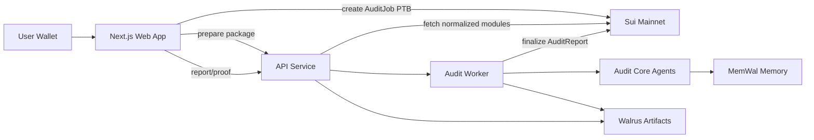

# TuskScan

TuskScan is a Sui Overflow Walrus-track project for wallet-native AI pre-audits of Sui Move smart-contract packages.

Users connect a Sui wallet, paste a GitHub repo/package URL, pay SUI into an onchain `AuditJob`, and receive a multi-agent Move vulnerability report. TuskScan scopes ingestion to Move package roots and `.move` source files, not the whole GitHub codebase. Normalized source snapshots, findings, reports, run logs, and memory diffs are stored as Walrus artifacts. Exploit lessons are written to a MemWal-compatible memory layer so later audits can recall prior patterns.

> TuskScan is AI pre-audit assistance for developer review. It is not a professional security audit and must not be treated as deployment approval.

## Current Audit Capability

TuskScan is built as a strong AI pre-audit system, not a replacement for a senior human security auditor.

Today it can:

- Scope GitHub source ingestion to the selected Move package root instead of loading an entire monorepo.
- Build normalized Move source snapshots from `sources/**/*.move` and `tests/**/*.move`.
- Optionally enrich source scans with deployed Sui package metadata from Sui RPC when publish metadata is available.
- Run deterministic Sui Move vulnerability rules across source and optional package metadata.
- Use LLM researcher, exploit-writer, patch-reviewer, and false-positive critic stages when configured.
- Recall prior exploit patterns from MemWal and mark matching findings as memory-assisted.
- Store reusable vulnerability patterns and audit observations back into MemWal.
- Store package snapshots, findings, reports, run logs, source context, and memory diffs as Walrus artifacts.
- Optionally clone source and run sandboxed `sui move test` plus generated compile-only exploit test skeletons.
- Persist wallet-owned audit history in Supabase so users can revisit reports later.

It does not yet claim to provide:

- Full formal verification.
- Symbolic execution.
- Bytecode/source-map equivalence proof.
- Guaranteed exploitability confirmation.
- Production certification or deployment approval.

The intended positioning is: fast wallet-native Sui Move pre-audits with verifiable artifacts and persistent agent memory.

## Architecture



## Workspace

- `apps/web`: Next.js app with Sui wallet connect, package prepare, payment/run flow, report/proof UI.
- `apps/api`: Node HTTP API for prepare/create/status/report/verify routes.
- `apps/worker`: paid audit worker with retry/dead-letter behavior.
- `packages/shared`: shared audit/report types.
- `packages/sui-integration`: Sui JSON-RPC package normalization and stable hashing.
- `packages/audit-core`: deterministic scanner rules and agent workflow.
- `packages/storage`: Walrus and MemWal-compatible storage helpers.
- `move/tuskscan`: Sui Move package for `AuditJob`, `AuditReport`, and operator finalization.
- `move/demo-package-a`: intentionally unsafe demo package that teaches memory.
- `move/demo-package-b`: intentionally unsafe demo package that should recall memory from A.
- `move/demo-package-c`: intentionally unsafe lottery package for predictable randomness and vector-bound findings.
- `docs/demo-packages.md`: publish commands and package ID recording area.

## Setup

Install dependencies:

```powershell
pnpm install
```

Install Sui CLI with `suiup`, then install the mainnet-compatible toolchain:

```powershell
suiup install sui@mainnet
suiup default set sui@mainnet
sui client active-address
```

Fund the active address with real mainnet SUI before publishing or running paid audits.

## Environment

Environment files are app-specific.

For local UI/API development, create:

- `apps/api/.env`: server-only runtime secrets and mainnet service config.
- `apps/web/.env`: public browser config that points the web app at `http://localhost:8787`.

TuskScan requires Mainnet Sui, the published TuskScan Move package, MemWal credentials, Walrus storage, and a Postgres/Supabase database for normal runtime. Local development can still run the API code on your machine, but it does not fall back to fake MemWal, fake Walrus storage, or a fake database.

`apps/web/.env`:

```env
NEXT_PUBLIC_TUSKSCAN_API_URL=http://localhost:8787
NEXT_PUBLIC_TUSKSCAN_NETWORK=mainnet
NEXT_PUBLIC_TUSKSCAN_PACKAGE_ID=<published move/tuskscan package id>
NEXT_PUBLIC_TUSKSCAN_CONFIG_ID=<shared AuditConfig object id created when move/tuskscan was published>
```

`NEXT_PUBLIC_TUSKSCAN_PACKAGE_ID` and `NEXT_PUBLIC_TUSKSCAN_CONFIG_ID` are required for the real wallet PTB. The web app no longer falls back to a mock payment digest.

`apps/api/.env` or deployment environment:

```env
PORT=8787
TUSKSCAN_ENV=production
SUI_NETWORK=mainnet
SUI_RPC_URL=https://fullnode.mainnet.sui.io:443
DATABASE_URL=<Supabase Postgres connection string>
TUSKSCAN_PRICE_MIST=1000000
TUSKSCAN_PACKAGE_ID=<published move/tuskscan package id>
TUSKSCAN_CONFIG_ID=<shared AuditConfig object id created when move/tuskscan was published>
TUSKSCAN_OPERATOR_ADDRESS=<operator wallet address paid by create_audit_job>
TUSKSCAN_OPERATOR_CAP_ID=<OperatorCap object id created when move/tuskscan was published>
TUSKSCAN_OPERATOR_PRIVATE_KEY=<operator Ed25519 private key for finalize_report>
WALRUS_AGGREGATOR_URL=https://aggregator.walrus-mainnet.walrus.space
WALRUS_STORAGE_EPOCHS=3
MEMWAL_PRIVATE_KEY=<MemWal delegate/private key>
MEMWAL_ACCOUNT_ID=<MemWal account id>
MEMWAL_NAMESPACE=tuskscan
MEMWAL_SERVER_URL=https://relayer.memwal.ai
LLM_API_KEY=<optional OpenAI-compatible API key for researcher/exploit/critic agents>
LLM_MODEL=gpt-4.1-mini
LLM_BASE_URL=https://api.openai.com/v1
TUSKSCAN_RUN_MOVE_TESTS=0
TUSKSCAN_SANDBOX_TIMEOUT_MS=120000
TUSKSCAN_SUI_BIN=sui
```

The API loads `apps/api/.env` automatically when run through `pnpm dev`. It no longer loads `.env.local`. The API fails on startup if Mainnet Sui, database, MemWal, Walrus SDK storage, or TuskScan contract/operator configuration is missing.

For real Walrus storage, use:

```env
TUSKSCAN_ENV=production
WALRUS_AGGREGATOR_URL=https://aggregator.walrus-mainnet.walrus.space
WALRUS_STORAGE_EPOCHS=3
```

Walrus Mainnet has a public Mysten aggregator, but no public unauthenticated Mysten publisher. TuskScan writes artifacts directly through the Walrus TypeScript SDK with `TUSKSCAN_OPERATOR_PRIVATE_KEY`; `WALRUS_PUBLISHER_URL` is only needed if you later choose to run a private authenticated HTTP publisher.

Supabase is used as the app index so a wallet can see prior audits after the API restarts. Get `DATABASE_URL` from Supabase dashboard: Project Settings -> Database -> Connection string -> URI. Use the server-side Postgres connection string, not the browser anon key. The API auto-creates the `audit_jobs` table on first use; the same schema is available at `supabase/schema.sql` if you prefer running it manually in Supabase SQL Editor.

The Prisma schema for the same table lives at `apps/api/prisma/schema.prisma`. For Supabase pooler connections, use `db:apply`; it applies `supabase/schema.sql` through `DATABASE_URL`.

```powershell
pnpm --filter api db:apply
pnpm --filter api db:generate
pnpm --filter api db:studio
```

Set `TUSKSCAN_RUN_MOVE_TESTS=1` only on an API machine with `git` and `sui` available. Use `TUSKSCAN_SUI_BIN` when the Sui binary is not on `PATH`. When enabled, TuskScan clones the submitted GitHub repo into a temporary sandbox, runs `sui move test` at the selected Move package root, injects generated compile-only exploit regression skeletons, and runs `sui move test tuskscan_`. This is not formal verification yet; it proves the package baseline and generated test harness compile path, then leaves fixture binding notes for concrete exploit PoCs.

## Run

Start the API:

```powershell
pnpm --filter api dev
```

Start the web app:

```powershell
pnpm --filter web dev
```

Open `http://localhost:3000`.

## Demo Script

1. Publish the core TuskScan Move package:

```powershell
cd E:\GithubProjects\sui-overflow\tuskscan\move\tuskscan
sui client publish --gas-budget 100000000
```

Set `NEXT_PUBLIC_TUSKSCAN_PACKAGE_ID` and `TUSKSCAN_PACKAGE_ID` to the published package ID. Record the `OperatorCap` object ID from the publish output as `TUSKSCAN_OPERATOR_CAP_ID`, and set both operator address env vars to the wallet that should receive audit payments.

2. Publish the demo packages:

```powershell
cd E:\GithubProjects\sui-overflow\tuskscan\move\demo-package-a
sui client publish --gas-budget 100000000

cd E:\GithubProjects\sui-overflow\tuskscan\move\demo-package-b
sui client publish --gas-budget 100000000

cd E:\GithubProjects\sui-overflow\tuskscan\move\demo-package-c
sui client publish --gas-budget 100000000
```

Record IDs in `docs/demo-packages.md`.

3. Start API and web.
4. Connect wallet.
5. Paste the Package A GitHub URL, pay, run audit, and verify artifacts.
6. Paste the Package B GitHub URL, pay, run audit, and confirm at least one memory-assisted finding.
7. Paste the Package C GitHub URL, pay, run audit, and confirm predictable randomness/vector-bound findings.

Committed `Published.toml` or lock metadata is optional enrichment for correlating source to a deployed package. The scanner still runs from the GitHub Move source when publish metadata is absent.

The pitch: Package A teaches the agent an exploit pattern; Package B proves the memory is portable and reusable through the Walrus/MemWal data layer; Package C shows the scanner also catches different source-aware bug classes.

## MemWal Memory Model

TuskScan stores reusable vulnerability knowledge in MemWal as structured records, not only as free-form report text.

- `vulnerability_pattern`: reusable Sui Move security knowledge keyed by rule/category. It stores signals, exploit model, fix pattern, and false-positive checks.
- `audit_observation`: a lightweight package-specific receipt that links one finding back to a reusable pattern.

This makes MemWal the agent memory layer: future audits recall prior Sui Move exploit patterns and use them to mark findings as memory-assisted. Supabase remains the app index for wallet history, while Walrus stores verifiable report artifacts.

## Future TBD

The next milestones to move TuskScan closer to professional-grade auditing:

- Generate runnable exploit PoCs by binding project-specific fixtures and object constructors.
- Compare source against deployed bytecode/source maps instead of module-name matching only.
- Add a stronger multi-agent debate loop: researcher -> exploit writer -> patch reviewer -> false-positive critic -> final judge.
- Calibrate confidence from confirmed historical outcomes, not only severity and memory matches.
- Add a sandbox harness that attempts generated attacks and records pass/fail evidence.
- Support package-specific invariant extraction from Move tests and docs.
- Add formal-analysis integrations where available for Move bytecode.
- Add reviewer mode for human auditors to confirm, reject, or upgrade findings and write those confirmations back to MemWal.
- Store confirmed vulnerability/fix outcomes as higher-trust MemWal records.
- Add report tiers: instant AI pre-audit, verified sandbox run, and human-reviewed certification.

## Checks

```powershell
pnpm lint
pnpm check-types
pnpm build
pnpm --filter @repo/audit-core test
pnpm --filter @repo/storage test
pnpm --filter api test
pnpm --filter worker test
sui move test
```

Demo package checks:

```powershell
cd E:\GithubProjects\sui-overflow\tuskscan\move\demo-package-a
sui move test

cd E:\GithubProjects\sui-overflow\tuskscan\move\demo-package-b
sui move test

cd E:\GithubProjects\sui-overflow\tuskscan\move\demo-package-c
sui move test
```
